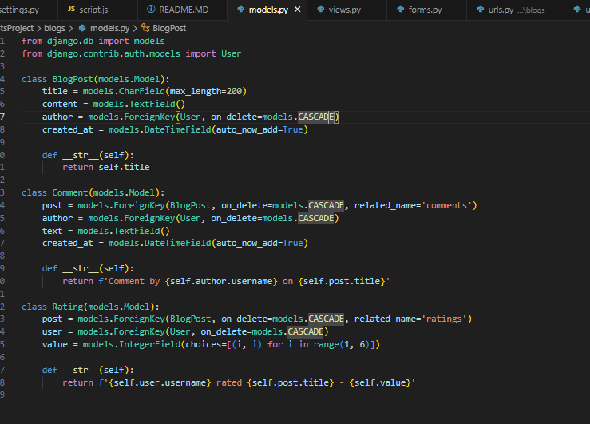
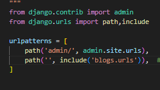
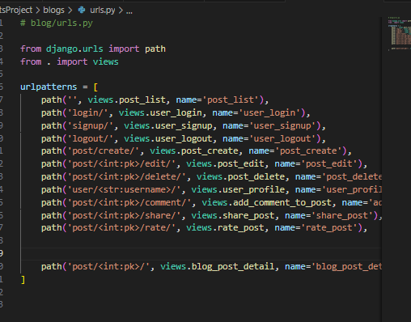
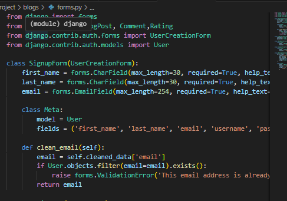

Steps to Build the API
1. Installation of Django REST Framework
To start building the API, Django was installed using the following command:

```bash
pip install django
```
2. Configuration in settings.py
    In the settings.py file, the following configurations were added:

```python

INSTALLED_APPS = [
    # ... other installed apps
    'lab5rest'
]

DEFAULT_PERMISSION_CLASSES = [
    'rest_framework.permissions.AllowAny',
]
```
3. Model and Serializer Setup
The models.py file was created to define the data structure for posts.

**models.py**



4. API Views and URL Configuration
API views were defined in apiviews.py, where a class-based view, was created to handle public posts. The URL routing was configured in urls.py to map the views to specific endpoints.




5. Forms . i added the forms.py to handle the forms for the usercreations and the creation of the posts ,commets and validation


6. i created the the templates follder to handle the html pages and the static folder to handle the javascript that handles the search functionality 
```javascript
function searchPosts() {
    var input, filter, cards, cardContainer, h5, title, content, i;
    input = document.getElementById("searchInput");
    filter = input.value.toUpperCase();
    cardContainer = document.getElementsByClassName("card");

    for (i = 0; i < cardContainer.length; i++) {
        title = cardContainer[i].querySelector(".card-title");
var result_batchSplitBatchNumberToSerialNumber = imsApiService.batchSplitBatchNumberToSerialNumber(imsApiSessionContext,
    stationNumber,                         // String
    batchNumber,                           // String
    processLayer,                          // int
    usedBatchQuantity,                     // double
    duplicateSerialNumber,                 // int
    ignoreBatchComplete                    // int
);
var return_value = result_batchSplitBatchNumberToSerialNumber.return_value;
if (return_value != 0) {
    
}        content = cardContainer[i].querySelector(".card-text");
        if (title || content) {
            if (title.innerHTML.toUpperCase().indexOf(filter) > -1 || content.innerHTML.toUpperCase().indexOf(filter) > -1) {
                cardContainer[i].style.display = "";
            } else {
                cardContainer[i].style.display = "none";
            }
        }
    }
}


```
7. Database Migration
The initial migration for the database was performed using the following commands:

```bash
python manage.py makemigrations
python manage.py migrate
```
8. Running the Development Server
To test the API, the Django development server was started:

```bash
python manage.py runserver
```
Visit

